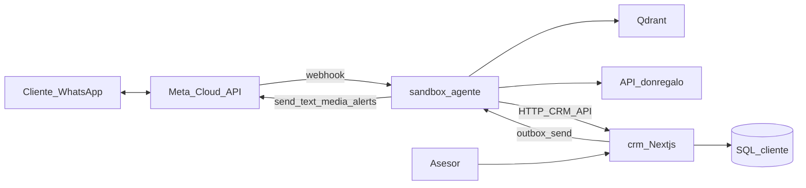

# Plan de rework — Opción C

Fecha: 2026-07-11  
Estado: **en implementación** (Bloque 1 casi completo; Bloque 2 iniciado)  
Base de referencia: kit `whatsapp-ai-agent-kit` (Next.js + Baileys + OpenRouter + SQLite + Airtable + Supabase + watchdog)

## Decisión

**Opción C:** CRM Next.js aparte + `sandbox/` solo como agente.

```text
agente-don-regalo/
├── app/          ← legacy producción (no tocar hasta cutover)
├── sandbox/      ← AGENTE: WhatsApp Cloud API + LLM + tools Don Regalo + Qdrant + watchdog
└── crm/          ← CRM: panel Next.js (estilo kit) + APIs sobre SQL del cliente
```

## Arquitectura objetivo



### Responsabilidades

| Pieza | Tecnología | Hace |
|---|---|---|
| **`sandbox/`** | FastAPI (actual) | Webhook Meta, buffer, agente, tools catálogo/Qdrant, handoff, **watchdog** (mute / saldo / fallback / parte diario) |
| **`crm/`** | Next.js inspirado en el kit | Inbox, modo AI/HUMAN, métricas, settings, leads; **sin Baileys ni Airtable ni Supabase** |
| **SQL del cliente** | MySQL/Postgres existente | Reemplaza SQLite operativo del kit + tablas de memoria tipo Supabase + leads tipo Airtable |

### Sustituciones del kit

| Kit | Nuestro stack |
|---|---|
| Baileys / QR | WhatsApp Cloud API |
| Airtable leads | Tablas/API en `crm/` + SQL cliente |
| Supabase memory | Tablas `lead_memory` / historial en SQL cliente (API en CRM) |
| SQLite panel | SQL cliente vía CRM |
| Watchdog vía Baileys | Watchdog en `sandbox/` avisando con Cloud API a `ALERT_WHATSAPP` |

### Watchdog (valor diferencial — se conserva)

Portar a Python en `sandbox/`:

1. **Bot mudo** — leads sin respuesta (ventana tipica 3 min–2 h)
2. **Saldo bajo** — OpenAI/OpenRouter según provider
3. **Spike de fallbacks** — mensaje de emergencia en bucle
4. **Parte diario IA** + sugerencias (nunca auto-aplica)
5. Anti-spam 30 min + `/health` para UptimeRobot

---

## Checklist de APIs

### Conservar (ya las usa el agente Don Regalo)

| API / capacidad | Uso |
|---|---|
| `donregalo.pe` catálogo | categorías, búsqueda, detalle, ocasiones, ofertas, destacados, distritos, pago, tipo cambio, rastreo |
| Qdrant productos | `buscar_semantico`, `productos_similares` |
| Qdrant conocimiento | `buscar_conocimiento_equipo` |
| OpenAI chat + Whisper + embeddings | agente, audio, vectores |
| WhatsApp Cloud API | inbound/outbound (canal nuevo) |

### Simular / construir en `crm/` (contrato HTTP; SQL detrás)

Para igualar Airtable + Supabase + SQLite del kit, el CRM debe exponer:

| API CRM | Reemplaza | Para qué |
|---|---|---|
| `POST/PATCH /api/leads` (upsert por teléfono) | Airtable `guardarLead` | Captura lead nombre/email/notas |
| `GET /api/leads?phone=` | Airtable lookup | Evitar duplicados |
| `GET/PUT /api/memory/{phone}` | Supabase `lead_memory` | Memoria largo plazo |
| `POST /api/memory/{phone}/messages` | Supabase `message_log` | Espejo opcional de mensajes |
| `GET/POST /api/conversations` + messages | SQLite kit | Inbox del panel |
| `PATCH /api/conversations/{id}/mode` | modo AI/HUMAN | Handoff |
| `POST /api/outbox` | outbox Baileys | Asesor envía → agente manda por Cloud API |
| `GET /api/analytics/*` | métricas kit | Dashboard |
| `GET/PUT /api/settings` | settings SQLite | paused, umbrales watchdog |
| `GET /api/watchdog/unanswered` | `getUnansweredConversations` | Mute detector |

### Faltantes en SQL del cliente (checklist de negocio/infra)

Confirmar o crear en la BD SQL de Don Regalo / CRM:

1. **`crm_contacts` / leads** — phone PK, name, email, notes, utm, timestamps
2. **`crm_lead_memory`** — phone PK, objetivo, situacion, temperatura, resumen, first/last_seen
3. **`crm_conversations`** — phone, mode AI\|HUMAN, bot flags, last_message_at
4. **`crm_messages`** — conversation_id, role, content, wa_message_id, created_at
5. **`crm_settings`** — key/value (paused, wd_*)
6. **`crm_outbox`** — mensajes del asesor pendientes de envío
7. **`crm_tool_events`** (opcional) — métricas de tools
8. **Endpoints HTTP** de la tabla anterior frente a esas tablas
9. **Auth del panel CRM** (login asesores)
10. **Webhook Meta** estable + `PHONE_NUMBER_ID` / token (infra)

No hace falta rehacer las APIs de catálogo `donregalo.pe`: se mantienen.

---

## Enfoque de implementación

1. Crear `crm/` partiendo del kit (Next.js), quitando Baileys / Airtable / Supabase.
2. Apuntar `crm` a SQL del cliente (ORM o BFF SQL).
3. Adelgazar `sandbox/`: solo agente + Cloud API + tools Don Regalo + watchdog; hablar con CRM por HTTP.
4. Mover o reemplazar el CRM mínimo actual en `sandbox/app/crm` por cliente HTTP hacia `crm/`.
5. Documentar y mantener este checklist actualizado en `docs/` según avance.

## Reglas de seguridad

- **No** ejecutar `sandbox/scripts/promote.ps1` ni reemplazar `app/` de producción hasta tener Meta + CRM + E2E listos.
- Desarrollar y probar en `sandbox/` + `crm/` sin romper el agente legacy en raíz.
- Watchdog **no** auto-aplica cambios de prompt; solo sugiere al dueño vía WhatsApp.

## Relación con docs existentes

| Documento | Rol |
|---|---|
| `docs/REWORK_SANDBOX.md` | Práctica sandbox → promoción (fase anterior) |
| `sandbox/docs/ARCHITECTURE.md` | Arquitectura del sandbox actual |
| `sandbox/docs/MIGRATION_CHECKLIST.md` | Checklist de cutover sandbox |
| **`PLAN_REWORK_OPCION_C.md`** (este archivo) | Dirección vigente: CRM sibling + agente + watchdog |

## Nota MySQL local (XAMPP)

En este entorno MySQL escucha en **puerto 3307** (`C:\xampp\mysql\bin\my.ini`), no 3306.

Credenciales de desarrollo confirmadas:

- BD: `donregalo_bd`
- User: `root`
- Password: (vacía)

Tablas CRM: prefijo `crm_*` (ver `crm/sql/001_crm_schema.sql`).

## E2E Meta (estado)

- Dry-run local **OK**: `sandbox/scripts/e2e_meta_sim.py` + `WHATSAPP_DRY_RUN=1`
- Guía live: `sandbox/docs/E2E_META.md`
- Pendiente para WhatsApp real: `WHATSAPP_TOKEN`, `WHATSAPP_PHONE_NUMBER_ID`, túnel público, `WHATSAPP_DRY_RUN=0`
