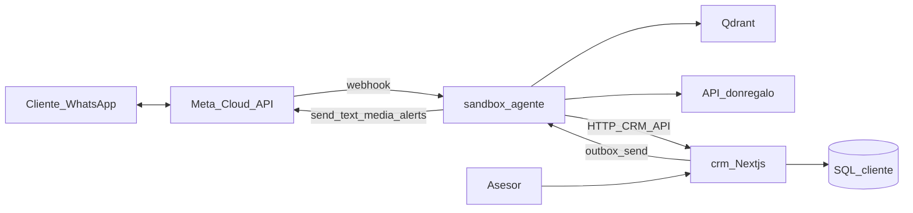

# Plan: CRM + Sandbox (Opción C)

**Estado:** aprobado (diseño) — pendiente de implementación  
**Fecha:** 2026-07-11  
**Referencia kit:** `whatsapp-ai-agent-kit` (Baileys + Next.js + Airtable + Supabase + watchdog)

---

## Decisión

**Opción C:**

| Carpeta | Rol |
|---------|-----|
| `crm/` | Monolito Next.js (panel + APIs), hermano de `sandbox/` |
| `sandbox/` | Solo agente: WhatsApp Cloud API + LLM + tools Don Regalo + Qdrant + **watchdog** |
| `app/` | Producción legacy — **no tocar** hasta cutover |

No se usa Baileys, Airtable ni Supabase. Se sustituyen por WhatsApp Cloud API + SQL del cliente vía CRM.

---

## Arquitectura objetivo

```text
agente-don-regalo/
├── app/          ← legacy prod (intacto)
├── sandbox/      ← AGENTE (Python/FastAPI)
└── crm/          ← CRM (Next.js, estilo kit)
```



### Responsabilidades

| Pieza | Tecnología | Hace |
|-------|------------|------|
| **`sandbox/`** | FastAPI (actual) | Webhook Meta, buffer, agente, tools catálogo/Qdrant, handoff, **watchdog** (mute / saldo / fallback / parte diario) |
| **`crm/`** | Next.js inspirado en el kit | Inbox, modo AI/HUMAN, métricas, settings, leads; sin Baileys/Airtable/Supabase |
| **SQL del cliente** | MySQL/Postgres existente | Sustituye SQLite operativo del kit + memoria tipo Supabase + leads tipo Airtable |

### Sustituciones del kit

| Kit | Nuestro stack |
|-----|---------------|
| Baileys / QR | WhatsApp Cloud API |
| Airtable leads | Tablas/API en `crm/` + SQL cliente |
| Supabase memory | Tablas `lead_memory` / historial en SQL cliente (API en CRM) |
| SQLite panel | SQL cliente vía CRM |
| Watchdog vía Baileys | Watchdog en `sandbox/` avisando con Cloud API a `ALERT_WHATSAPP` |

---

## Watchdog (valor diferencial — conservar)

Portar a Python en `sandbox/` (referencia kit: `src/lib/watchdog.ts`, `docs/10-watchdog.md`):

1. **Bot mudo** — leads sin respuesta (ventana tipica 3 min–2 h)
2. **Saldo bajo** — créditos OpenAI/OpenRouter según provider
3. **Spike de fallbacks** — mensaje de emergencia en bucle
4. **Parte diario IA** + sugerencias (nunca auto-aplica)
5. Anti-spam 30 min + endpoint `/health` para UptimeRobot

---

## Checklist de APIs

### Conservar (ya las usa el agente Don Regalo)

| API / capacidad | Uso |
|-----------------|-----|
| `donregalo.pe` catálogo | categorías, búsqueda, detalle, ocasiones, ofertas, destacados, distritos, pago, tipo cambio, rastreo |
| Qdrant productos | `buscar_semantico`, `productos_similares` |
| Qdrant conocimiento | `buscar_conocimiento_equipo` |
| OpenAI chat + Whisper + embeddings | agente, audio, vectores |
| WhatsApp Cloud API | inbound/outbound (canal nuevo) |

### Simular / construir en `crm/` (contrato HTTP; SQL detrás)

Reemplazo de Airtable + Supabase + SQLite del kit:

| API CRM | Reemplaza | Para qué |
|---------|-----------|----------|
| `POST/PATCH /api/leads` (upsert por teléfono) | Airtable `guardarLead` | Captura lead nombre/email/notas |
| `GET /api/leads?phone=` | Airtable lookup | Evitar duplicados |
| `GET/PUT /api/memory/{phone}` | Supabase `lead_memory` | Memoria largo plazo |
| `POST /api/memory/{phone}/messages` | Supabase `message_log` | Espejo opcional de mensajes |
| `GET/POST /api/conversations` + messages | SQLite kit | Inbox del panel |
| `PATCH /api/conversations/{id}/mode` | modo AI/HUMAN | Handoff |
| `POST /api/outbox` | outbox Baileys | Asesor envía → agente manda por Cloud API |
| `GET /api/analytics/*` | métricas kit | Dashboard |
| `GET/PUT /api/settings` | settings SQLite | paused, umbrales watchdog |
| `GET /api/watchdog/unanswered` | `getUnansweredConversations` | Mute detector |

### Faltantes en SQL del cliente (checklist de negocio)

Confirmar o crear en la BD de Don Regalo / CRM:

1. **`crm_contacts` / leads** — phone PK, name, email, notes, utm, timestamps
2. **`crm_lead_memory`** — phone PK, objetivo, situacion, temperatura, resumen, first/last_seen
3. **`crm_conversations`** — phone, mode AI\|HUMAN, bot flags, last_message_at
4. **`crm_messages`** — conversation_id, role, content, wa_message_id, created_at
5. **`crm_settings`** — key/value (paused, wd_*)
6. **`crm_outbox`** — mensajes del asesor pendientes de envío
7. **`crm_tool_events`** (opcional) — métricas de tools
8. **Endpoints HTTP** de la tabla anterior frente a esas tablas
9. **Auth del panel CRM** (login asesores)
10. **Webhook Meta** estable + `PHONE_NUMBER_ID` / token (infra)

No hace falta rehacer las APIs de catálogo `donregalo.pe`.

---

## Enfoque de implementación

1. Crear `crm/` partiendo del kit (Next.js), quitando Baileys / Airtable / Supabase.
2. Apuntar `crm` a SQL del cliente (Prisma/Drizzle u ORM equivalente).
3. Adelgazar `sandbox/`: solo agente + Cloud API + tools Don Regalo + watchdog; hablar con CRM por HTTP.
4. Migrar el CRM mínimo actual de `sandbox/app/crm` hacia el servicio `crm/` (o dejarlo como cliente HTTP).
5. Documentar y mantener este checklist actualizado.

**No ejecutar** `sandbox/scripts/promote.ps1` ni reemplazar la raíz hasta Meta + CRM + E2E listos.

---

## Contexto ya existente (no borrar)

- Sandbox actual (Cloud API + CRM SQLite interno + agente): ver `docs/REWORK_SANDBOX.md`, `sandbox/docs/ARCHITECTURE.md`
- Producción legacy: carpeta `app/` + Chatwoot + Evolution
- Kit de referencia (local): `C:\Users\ADMIN\Downloads\whatsapp-ai-agent-kit-extract\`
  - Watchdog: `src/lib/watchdog.ts`, `docs/10-watchdog.md`
  - Memoria: `src/lib/memory.ts`
  - DB panel: `src/lib/db.ts`
  - Tools kit: `src/lib/tools/` (guardarLead, calificar — adaptar a CRM SQL)

---

## Próximo paso

Tras aprobación de este documento: scaffold `crm/` + contrato de APIs + port del watchdog en `sandbox/`.
